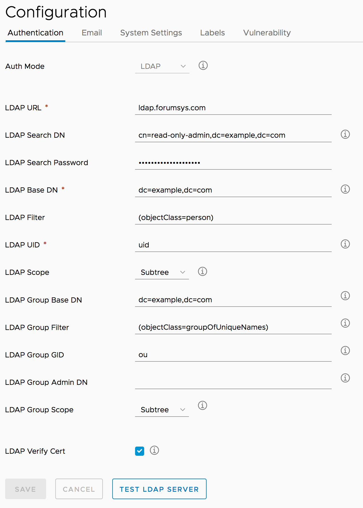

# Harbor Demo

The purpose of this repo is to outline the steps taken to setup an environment for [Harbor](https://github.com/goharbor/harbor). 

Includes additional examples and discoveries while working on the demo.

### What is Harbor?
> Harbor is an open source cloud native registry that stores, signs, and scans container images for vulnerabilities.
> 
>Harbor solves common challenges by delivering trust, compliance, performance, and interoperability. It fills a gap for organizations and applications that cannot use a public or cloud-based registry, or want a consistent experience across clouds

Lighting Talk slides can be found [here](https://prezi.com/view/NzcvsMfHBfz1LQRpqhuE/)

### Installation

It is recommended to install Harbor using Helm Charts, The latest chart can be found at [goharbor/habor-helm](https://github.com/goharbor/harbor-helm)

1. K8s 1.8+ cluster
2. K8s ingress controller enabled
3. Helm and Tiller (with clusteradmin permissions) - this is for cert manager not harbor
4. SSL certificates. (I used lets Encrypt cert-manager to accomplish this)
5. add harbor and notary urls to Ingress (I do this outside of the harbor install and disable ingress as part of the install steps of the harbor helm charts)
6. setup storage (S3)
7. clone [harbor-helm repo](https://github.com/goharbor/harbor-helm)
8. update harbors helm values.yaml file with changes: (Some major ones of note: externalDomain, AdminPassword, AuthenticationMode(local or LDAP), Email, secretKey. Disable ingress, Storage for registry)
9. update **UI** and **Notary** svc.yaml templates to include **NodePort** for ingress
10. Install chart using custom values.yaml file
11. Wait a few minutes before attempting to access the environment

*on first access the system will take time to start up with a "Loading..." screen, or a 502 Bad Gateway message, after about 10 minutes it will come up

Post Installtion Configuration steps:
1. create users (if local)
2. create projects (public or private)
3. add members to projects

### Demo Environment
GKE work:
1. setup ingress
2. setup lets encrypt (see GKE repo for notes)

install harbor:
`helm install --debug --name demo -f demo-values.yaml .`

to upgrade a release::
`helm upgrade demo --debug -f demo-values.yaml .`

## Using Harbor

setup:
1. create user named `demo-admin` and `demo-dev`
2. create project named `demo-public` (check public box) and `demo-private`
3. add `demo-admin` as `Project Admin` role on `demo-public` project
4. add `demo-dev` as `Developer` role on `demo-private` project

#### Example 1: pushing docker images to public registry as admin
1. login to docker: `docker login -u demo-admin harbor.domain.io`
2. tag image: `docker tag msql:latest harbor.domain.io/demo-public/mysql:demo`
3. push image: `docker push harbor.domain.io/demo-public/mysql:demo`

#### Example 2: pushing docker images to private registry with permission as dev
1. login to docker: `docker login -u demo-dev harbor.domain.io`
2. tag image for private: `docker tag mysql:latest harbor.domain.io/demo-private/mysql:dev`
3. push to private repo:` docker push harbor.domain.io/demo-private/mysql:dev`

#### Example 3: self registration enabled
1. open ui site: https://harbor.domain.io
2. fill out form and username of `self-register`
3. login with newly created account
4. log into docker: `docker login -u self-register harbor.domain.io`
5. pull public image: `docker pull harbor.domain.io/demo-public/mysql:demo`
6. try and push to public repo: `docker push harbor.domain.io/demo-public/mysql:demo`
    - results: shows **access denied** because `self-register` is not a member of the `demo-public` repo. 

#### Example 4: vulnerability scanning with clair
1. enable scan on push: configuration section of project
2. run scan on image
3. upload new image and see it get auto scanned

#### Example 5: pushing helm chart
1. install [helm push](https://github.com/chartmuseum/helm-push) plugin if not already installed
2. add harbor to helm repo list: `helm repo add --username=demo-admin --password=REPLACEME harbor-demo-public https://harbor.domain.io/chartrepo/demo-public`
3. make a helm package by creating by cloning a repo with helm chart ex: [otter-api](https://github.com/zachpuck/otter-api) and from the cloned repo running `helm package charts/otter-api`
4. push the package: `helm push --username=demo-admin --password=REPLACEME otter-api-0.1.0.tgz harbor-demo-public`

*see harbor docs on [manage-helm-charts](https://github.com/goharbor/harbor/blob/master/docs/user_guide.md#manage-helm-charts)

#### Example 6: Labels
1. create global label under configuration
2. create project specific label under project > configuration

#### Example 7: harbor cli

1. run from a docker image using an alias:
`alias harbor='docker run -e HARBOR_USERNAME="admin" -e HARBOR_PASSWORD="REPLACEME" -e HARBOR_PROJECT=1 -e HARBOR_URL="https://harbor.domain.io" --rm krystism/harborclient harbor'`
2. create a user: `harbor user-create --username=cli-user --password=12345678 --email=cli-user@example.com`

*It is useful for managing harbor via the cli for administration: users, projects, replication, configuration, logs, ect...
Provides ways to automate the setup of harbor

**I am finding some commands are not working and it is limited on the management of users (not able to add a user to a project). Though the API does provide many options for automation as an alternative. 

Links: 
- https://github.com/goharbor/harbor/tree/master/contrib/harbor-cli
- https://github.com/int32bit/python-harborclient

#### Example 7: Replication
1. add new endpoint under "registries" of admin section
2. choose replication schedule (immediant or scheduled)

--- 
#### Additional
LDAP integration (using online LDAP test server)
- set ldap settings in values.yaml file for helm chart to include settings for ldap server.
- Example Authentication Settings:

Oauth2: 
Part of roadmap but work has not started yet: https://github.com/goharbor/harbor/blob/master/ROADMAP.md

Notary and signing
- https://github.com/goharbor/harbor/blob/master/docs/use_notary.md
- https://github.com/theupdateframework/notary

TODO:

Disaster Recovery:
- the database statefulset runs postgres and has a database called "registry" this appears to contains many of the settings for the harbor instance. 

High Availability
- https://github.com/goharbor/harbor/blob/master/docs/high_availability_installation_guide.md